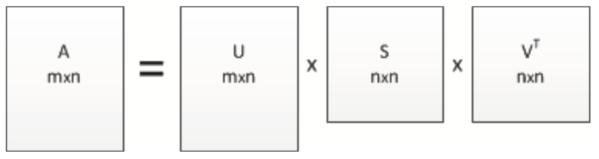
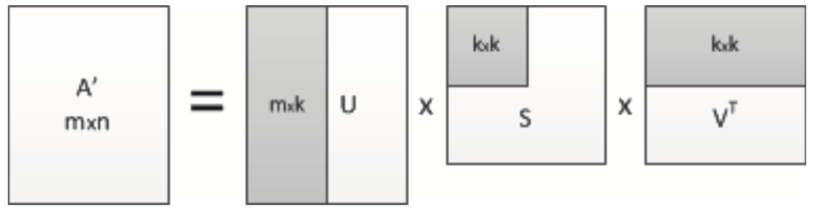

## Введение
Под тезаурусом предметной области мы понимаем набор ключевых 
понятий этой области, связанных между собой определенными 
семантическими отношениями. Основным назначением тезауруса предметной 
области является предоставление стандартизированной терминологии 
для описания относящихся к предметной области информационных ресурсов.

Существует два способа построения тезауруса предметной области: 
ручной способ, с привлечением труда экспертов, и автоматический. 
Ручной способ отличается высокой трудоемкостью, что делает актуальной 
проблему автоматического построения тезауруса. Целью данной 
работы является автоматическое построение тезауруса предметной 
области с помощью статистических методов обработки текстов на 
естественном языке. В основе статистических методов лежит предположение 
о том, что ключевые слова, описывающие содержание предметной 
области, по-разному распределяются среди релевантных и 
нерелевантных документов. Термин «релевантность» мы используем 
здесь в широком смысле, называя релевантными документы, тематика 
которых относится к заданной предметной области.

Для достижения указанной цели требуется выполнить следующие задачи:

1.  Подготовить обучающую коллекцию, содержащую два класса документов -- релевантных и нерелевантных по отношению к заданной предметной области.

2.  Сформировать словарь на основе документов обучающей коллекции.

3.  Выделить из словаря ключевые понятия предметной области.

4.  Построить семантические отношения между извелечёнными ключевыми понятиями.

5.  Проверить валидность созданного тезауруса (оценить его применимость для автоматической классификации документов предметной области)

## Подготовка обучающей коллекции документов
Подготовка обучающей коллекции представляет собой отбор документов из 
множества документов, имеющихся в распоряжении исследователя. Ключевым 
моментом подготовки обучающей коллекции является разбиение документов 
на «релевантные» (соответствующие предметной области) и «нерелевантные».

Поскольку от качества обучающей коллекции зависит качество результатов 
всей работы по созданию тезауруса, то ее формирование может оказаться 
итеративным процессом. В ходе проведения экспериментов обучающая 
коллекция может пополняться, корректироваться, что соответствует 
возрастающему характеру обучения, заключающемуся в накоплении знаний 
методом проб и ошибок.

## Формирование словаря обучающей коллекции

Под словарём обучающей коллекции документов мы понимаем множество всех слов коллекции,
приведенных к нормальной форме. В русском языке нормальными формами являются:
для существительных - именительный падет единственного числа, для 
прилагательных -- именительный падеж единственного числа мужского рода,
для глаголов, причастий и деепричастий -- глагол в инфинитиве.

Построение словаря состоит из двух этапов: токенизации, т. е. разбиение
текстов документов на минимальные лексические компоненты -- слова (токены),
и лемматизации, то есть приведения выделенных слов к нормальным формам (леммам).
Токенизация является начальным этапом автоматической обработки текстов, и,
как отмечается в работе [@tokenize2012bocharov], ошибки, допущенные на данном этапе,
существенно влияют на дальнейший процесс обработки. Нам известны два
основных способа построения токенизаторов. Первый способ заключается в построении 
токенизатор, способного распознавать в тексте заранее заданные паттерны,
второй способ основан на обучении токенизатора новым паттернам. В данной
работе мы используем алгоритм токенизации,основанный на распознавании
следующих паттернов:

- пробел и знаки препинания являются разбелителями слов-токенов;

- цепочки букв с числами принимаются как один токен;

- двойные имено собственные понимаются как один токен;

- обозначения даты и времени понимаются как один токен;

- специальные сокращения (например, P.S.) понимаются как один токен;

- дробные числа понимаюбтся как один токен;

- имено собтственные, включающие инициалы, понимаются как один токен;

Лемматизация необходима для компрессии получившиегося словника. Лемматизация
предствляет собой сложную исследовательскую задачу, требующую разрешения 
неоднозначностей естественного языка, таких как минонимия, омонимия, полисемия.
Например, в предложении "Дети ели кашу" для слова "ели" правильным вариантом 
леммы является глагол "есть", а в предложении "В саду росли ели" правильным
вариантом леммы является существительное "ель". В каком значении употреблена
словоформа "ели" можно узнать только из котекста, но для этого лемматизатор
должен быть усилен модулем синтаксического анализа. В работе @morphanalyse2006morozov был выполнен 
анализ вляния лемматизации на качество информационного поиска, позволивший 
авторам работы сделать вывод, что отказ от лемматизатора существенно понижает
полноту и точность результатов поиска.

В данной работе для токенизации и лематизации текстов мы используем свободно
распространяемый компонент анализатора, размещённый на сайте @aot.

## Отбор из словаря ключевых понятий предметной области

Очевидно, что словарь всех слов бучающей коллекции не может являться
тезаурусом, поскольку помимо интересующих нас ключевых понятий содержит
стоп-слова и другие неинформативные термины.

В данной работе для отсечения неинформативных терминов мы используем 
критерий $\chi^2$, величина которого позволяет судить о том, насколько
независимы между собой определенный термин и предметная область @autotextprocessing2011bolshakova.
Выбор данного критерия обусловлен его простотой и универсальностью,
которые позволяют применять его в большом количестве самых разнообразных
задач, связанных с проверкой согласия модели и опытных данных.

$$
\chi^2 = \frac
            {|TS| \times (TSD_1 \cdot TSN_0 - TSD_0 \cdot TSN_1)^2}
            {\{ 
                (TSD_1 + TSD_0) \cdot (TSN_1 + TSN_0) \times 
                (TSD_1 + TSN_1) \cdot (TSD_0 + TSN_0)
            \}}
$${#eq:chisquad}

Расшифровка обозначений для выражений, участвующих в расчёте
критерия $\chi^2$ согласно формуле (@eq:chisquad), приведена в @tbl:params.

+--------------------+------------------------------------------------------------------------------------------------------------------+
| Параметр           | Расшифровка                                                                                                      |
+:==================:+==================================================================================================================+
|$\|TS\|$            | Мощность множества документов обучающей коллекции                                                                |
+--------------------+------------------------------------------------------------------------------------------------------------------+
|$TSD_1$             | Количество документов обучающей коллекции, которые принадлежат предметной области и содержит данный термин       |
+--------------------+------------------------------------------------------------------------------------------------------------------+
|$TSD_0$             | Количество документов обучающей коллекции, которые принадлежат предметной области и не содержат данный термин    |
+--------------------+------------------------------------------------------------------------------------------------------------------+
|$TSN_1$             | Количество документов обучающей коллекции, которые не принадлежат предметной области и содержат данный термин    |
+--------------------+------------------------------------------------------------------------------------------------------------------+
|$TSN_0$             | Количество документов обучающей коллекции, которые не принадлежат предметной области и не содержат данный термин |
+--------------------+------------------------------------------------------------------------------------------------------------------+
table: Выражения, участвующие в рачете критерия **$\chi^2$** {#tbl:params}

Данный критерий мы будем вычислять для каждого входящего в словарь слова.
Будем включать слово в тезаурус, если значение критерия для него превышает
некоторую положительную величину, которую назовём пороговой.

Значение пороговой величины можно варьировать, чем оно выше, 
тем точнее тезаурус. Однако нужно учитывать, что слишком высокое значение
пороговой величины может привести к потере части ключевых слов.

## Построение семантических отношений между ключевыми понятиями предетной области

Построение семантической сети, связывающей между собой понятия предметной 
области, представляет собой сложный и творческий процесс и 
требует отдельного исследования. В данной работе мы установим 
ассоциативные связи между из-влеченными ключевыми понятиями на основе 
латентного семантического анализа @systemanalyse2010sedov. Латентный семантический анализ -
это метод выявления взаимосвязей между документами текстовой коллекции 
и терминами, встречающимися в этих документах. В основе метода лежат 
принципы факторного анализа: выявление латентных связей между 
изучаемыми объектами и сокращение числа этих объектов за 
счет объединения групп взаимозависимых обьектов. Метод является 
чисто статистико-алгебраическим, поскольку не использует 
созданных человеком онтологий для анализа связей.

Для выполнения латентного семантического анализа на множестве 
документов коллекции мы построим матрицу «термины-на-документы», 
строки которой соответствуют ключевым словам тезауруса, 
а столбцы -- документам. На пересечении строки 
(слова) и столбца (документа) укажем частоту вхождения данного 
слова в данный документ. Каждое слово в матрице будет представлять
собой вектор-строку, а каждый документ -- вектор столбец. Согласно
теореме о сингулярном разложении полученная матрица может быть
представлена в виде произведения трех матриц:

$$
A = USV^T
$${#eq:svd}

где $A$ -- это исходная матрица; 
$U$ -- ортогональная матрица размеров $m \times n$;
$V$ -- ортогональная матрица размеров $n \times n$;
$S$ -- диагональная матрица размеров $n \times n$, элементы
которой на главной диагонали упорядочены по убыванию @fig:singular.

Ненулевые элементы матрицы $S$ из (@eq:svd) называются 
сингулярными числами матрицы и равны арифметическим 
значениям квадратных корней из соответствуюших
собственных значений матрицы $AA^T$.

{#fig:singular}

Такое раложение обладает тем свойством, что если в матрице
$S$ оставить только $k$ наибольгих сингулряных значений, а
в матрицах $U$ и $V$ -- только соответствующие этим значениям 
столбцы и строки, то произведение получившихся матриц 
(матрица $A^\prime$) будет наилучшим приблиджением матрицы
ранга $k$ к исходной матрице $A$ @calcanalyse2007tyrtyshnikov .

{#fig:approx}

Получившияся матрица $A^\prime$ (@fig:approx) точнее отражает 
структуру связей в исходной коллекции @systemanalyse2010sedov. Исходя из этой
матрицы, мым ожем оценить близость между словами коллекции как
расстояние между соответствующими векторами при помощи 
косинусной меры (@eq:cos) или евклидова расстояния (@eq:rho).

$$
c = \cos(\vec{x}, \vec{y}) = \frac {\vec{x}\cdot\vec{y}}{|x|\cdot|y|}
$${#eq:cos}
$$
\rho = \rho(\vec{x},\vec{y}) = \sqrt{\sum(x_i - y_i)^2}
$${#eq:rho}
где с -- это косинусная мера; $\rho$ -- евклидово расстояние;
$x$, $y$ -- это строки и столбцы, представляющие документ или термины,
в новой матрице $A^\prime$.

## Проверка валидности тезауруса (оценка применимости тезауруса для классификации документов)

Чтобы проверить валидность полученного тезауруса, используем 
его для автоматической классификации документов по двум классам: 
класс документов предметной области и класс документов, 
не относящихся к предметной области. В качестве метода 
классификации используем метод Роккио.

Выбор данного метода обусловлен простотой и естественностью 
его геометрической интерпретации. Кроме того, как отмечено в @RCO2008pleshko, 
"качество", и в меньшей степени -- от выбора алгоритма. 
Разумеется, речь идет о сравнении между такими известными 
алгоритмами, как машина опорных векторов, наивный 
байесовский классификатор, алгоритм К-ближайших соседей [@RCO2008pleshko, @webdoc2005miksakov].

**Описание векторной модели представления документа.** Метод Роккио, 
как и большинство других методов классификации, представляет 
документ в векторном пространстве терминов тезауруса как 
вектор, координаты которого равны весам терминов 
в данном документе:

$$\vec{d} = (w_1, w_2, \dotsc , w_T),$$

здесь $T$ -- размерность тезауруса (количество терминов);
$\vec{d}$ -- вектор, представляющий документ;
координаты $w_i$ ($i$=1...$T$) -- веса терминов в документе.  
Для расчета весов мы используем модель ТF-IDF (Term Frequency -- 
Inverse Document Frequenсу), согласно которой вес термина 
в документе прямо пропорционален частоте его вхождения 
в документ и обратно пропорционален количеству документов,
в которых он встречается:  

$$w_i = F_i \cdot \log(\frac{D}{DF_i}),$$

где $w_i$ и $F_i$ -- вес и частота термина $i$ в документе соответственно;
$D$ -- общее число документов; $DF_i$ -- число документов, в которых встречается
термин $i$.

Данная модель не учитывает того факта, что документы могут 
иметь разную длину, вследствие чего частота термина, 
а значит и его вес будут тем меныше, чем больше 
длина документа. Мы выполним нормирование весов терминов 
в документе путем их деления на евклидову норму 
(длину вектора-документа):

$$
w_i^* = \frac{w_i}{\vec{d}} = \frac
                                 {w_i}
                                 {\sqrt{ \sum_{i=1}^T w_i}}
$$

**Описание алгоритма классификации.** Суть алгоритма Роккио 
заключается в вычислении близости между векторами документов 
и центроидом класса документов, относящихся к предметной области.
Под центроидом понимается усредненный вектор класса

$$
\vec{\mu_D} = \frac{1}{|TSD|} \sum_{i:d_i \in TSD} \vec{d_i}
$$

где $TSD$ -- это подмножество обучающей коллекции,
состоящей из документов, относящихся к предметной области;
$\vec{d_i}$ -- это документы, принадлежащие подмножеству $TSD$.

Документ будет считаться принадлежащим предметной области, 
если расстояние между центроидом класса и вектором документа 
будет меньше определенной величины, которую назовем радиусом класса.
Под расстоянием между векторами мы понимаем евклидово расстояние, 
вычисляемое по формуле (@eq:rho).

**Оценка качества классификации.** Основными показателями качества 
классификации являются уровни ошибок первого и второго рода @classscore2007vezhnevec. 
Ошибка первого рода или ложный пропуск (false negative) фиксируется, 
когда документ, относящийся к заданному классу, ошибочно не обнаруживается. 
Ошибка второго рода или ложное обнаружение (false positive) фиксируется, 
когда документ, не относящийся к заданному классу, 
ошибочно полагается относящимся.

Пусть экспериментальная выборка содержит S документов, 
в том числе SD документов, относящихся к предметной области, 
и SN документов, не относящихся к ней. Очевидно, 
что $S=SD+SN$. Используя эти величины, можно рассчитать 
процент уровней ошибок первого и второго рода.

$$
nFN = \frac{FN}{SD} \times 100\%
$$
$$
nFP = \frac{FP}{SN} \times 100\%
$$

где $nFN$ и $nFP$ -- проценты уровней ошибок первого
и второго рода соответственно; $FN$ и $FP$ -- количество
ложных пропусков и ложных обнаружений соответственно.

## Экспериментальная часть

Для проведения экспериментов мы выбрали предметную область «Автомобили». 
Нами была подготовлена обучающая коллекция из 2000 документов, 
представляющих собой статьи, опубликованные на новостном сайте @gazetaru. 
Из них половина документов относилась к предметной области 
«Дорожное движение», половина –- к другим предметным областям 
(культура, наука, финансы и т. д).

В результате токенизации и лемматизации из текстов обучающей коллекции 
был сформирован словарь объемом в 53745 приведенных к нормальной форме слов. 
К словам словаря был применен критерий $\chi^2$, который позволил 
выделить 567 ключевых понятий предметной области «Дорожное движение». 
Пороговое значение критерия $\chi^2$ было взято равным 18.

В @tbl:30dd приведены первые 30 слов с наивысшим значением критерия, 
а в @tbl:10dd –- последние 10 слов с наименьшим значением критерия.  
Затем мы выполнили поиск ассоциативных связей между словами тезауруса. 
С этой целью была сформирована матрица «термины-на-документы» 
размерностью 567 (по числу терминов тезауруса) на 1000 (по 
числу документов обучающей коллекции, относящихся к 
предметной области). В ячейках матрицы были записаны частоты вхождения 
терминов в документы. С помощью сингулярного разложения полученная 
матрица была аппроксимирована матрицей ранга 200. В [@tbl:beforesvd; @tbl:aftersvd]
показаны фрагменты матрицы «термины-на-документы» до 
и после сингулярного разложения.

+---------------+-------------------+
|Слово          | Значение          |
+:=============:+:=================:+
|Автомобиль     | 1303,05           |
+---------------+-------------------+
|Машина         |  859,96           |
+---------------+-------------------+
|Водитель       |  665,37           |
+---------------+-------------------+
|ГИБДД          |  485,39           |
+---------------+-------------------+
|Дорожный       |  458,34           |
+---------------+-------------------+
|Дорога         |  398,97           |
+---------------+-------------------+
|ДТП            |  396,17           |
+---------------+-------------------+
|Транспортный   |  352,87           |
+---------------+-------------------+
|Авария         |  300,38           |
+---------------+-------------------+
|Километр       |  298,01           |
+---------------+-------------------+
|Полоса         |  247,24           |
+---------------+-------------------+
|Руль           |  241,44           |
+---------------+-------------------+
|Скорость       |  232,22           |
+---------------+-------------------+
|Газета         |  231,69           |
+---------------+-------------------+
|Автомобильный  |  222,89           |
+---------------+-------------------+
|Произойти      |  219,35           |
+---------------+-------------------+
|Трасса         |  207,16           |
+---------------+-------------------+
|Автомобилист   |  203,11           |
+---------------+-------------------+
|Транспорт      |  199,91           |
+---------------+-------------------+
|Автовладелец   |  186,98           |
+---------------+-------------------+
|Уголовный      |  185,90           |
+---------------+-------------------+
|Легковой       |  180,26           |
+---------------+-------------------+
|Пострадать     |  178,37           |
+---------------+-------------------+
|Ехать          |  178,12           |
+---------------+-------------------+
|Погибнуть      |  175,62           |
+---------------+-------------------+
|Район          |  175,46           |
+---------------+-------------------+
|Внедорожник    |  166,85           |
+---------------+-------------------+
|Гаишник        |  164,89           |
+---------------+-------------------+
|МВД            |  164,52           |
+---------------+-------------------+
|Пробка         |  164,52           |
+---------------+-------------------+
table: Первые 30 ключевых терминов предметной области "Дорожное движение" {#tbl:30dd}

+---------------+-------------------+
|Слово          | Значение          |
+:=============:+:=================:+
|   Человек     |  18,94            |
+---------------+-------------------+
|    Город      |  18,89            |
+---------------+-------------------+
| Остановить    |  18,62            |
+---------------+-------------------+
|    Купе       |  18,51            |
+---------------+-------------------+
|  Наземный     |  18,51            |
+---------------+-------------------+
|   Подушка     |  18,51            |
+---------------+-------------------+
| Ярославский   |  18,51            |
+---------------+-------------------+
| Сократиться   |  18,41            |
+---------------+-------------------+
|   Вправо      |  18,38            |
+---------------+-------------------+
|  Эвакуатор    |  18,38            |
+---------------+-------------------+
table: Последние 10 терминов предметной области "Дорожное движение" {#tbl:10dd}

+---------------------+-------+-------+-------+-------+-------+-------+-------+
|Термины \\ Документы |   1   |   2   |   3   |   4   |   5   |   6   |   7   |
+:===================:+:=====:+:=====:+:=====:+:=====:+:=====:+:=====:+:=====:+
|**1**                |   8   |   7   |   0   |   0   |   0   |   5   |   0   |
+---------------------+-------+-------+-------+-------+-------+-------+-------+
|**2**                |   1   |   0   |   0   |   0   |   0   |   0   |   0   |
+---------------------+-------+-------+-------+-------+-------+-------+-------+
|**3**                |   7   |   0   |   0   |   0   |   0   |   0   |   0   |
+---------------------+-------+-------+-------+-------+-------+-------+-------+
|**4**                |   1   |   1   |   3   |   4   |   2   |   0   |  16   |
+---------------------+-------+-------+-------+-------+-------+-------+-------+
|**5**                |   4   |   1   |   0   |   1   |   2   |   0   |   0   |
+---------------------+-------+-------+-------+-------+-------+-------+-------+
|**6**                |   3   |   1   |   0   |   1   |   3   |   0   |   0   |
+---------------------+-------+-------+-------+-------+-------+-------+-------+
|**7**                |   2   |   0   |   0   |   0   |   0   |   0   |   0   |
+---------------------+-------+-------+-------+-------+-------+-------+-------+
table: Фрагмент таблицы "термина-на-документы" до сингулярного преобразования {#tbl:beforesvd}

+-------------------------+--------+---------+---------+---------+---------+---------+----------+
|Термины \\ Документы     | 1      |  2      |  3      |  4      |  5      |  6      |  7       |
+:=======================:+:======:+:=======:+:=======:+:=======:+:=======:+:=======:+:========:+
|1                        | 8,0520 | 7,0977  | -0,0011 | -0,1328 | -0,0810 | 4,9294  |  0,0244  |
+-------------------------+--------+---------+---------+---------+---------+---------+----------+
|2                        | 1,3677 | -0,0972 | 0,0968  | 0,4338  | -0,1015 | 0,0249  |  0,0005  |
+-------------------------+--------+---------+---------+---------+---------+---------+----------+
|3                        | 6,3477 | -0,0353 | 0,0826  | 0,1404  | -0,1713 | -0,1027 | -0,1166  |
+-------------------------+--------+---------+---------+---------+---------+---------+----------+
|4                        | 1,0124 | 1,0247  | 3,0212  | 4,0735  | 1,9890  | 0,0292  | 15,9325  |
+-------------------------+--------+---------+---------+---------+---------+---------+----------+
|5                        | 4,1900 | 1,1507  | -0,0763 | 1,1001  | 2,0669  | -0,1085 | -0,04347 |
+-------------------------+--------+---------+---------+---------+---------+---------+----------+
|6                        | 2,8336 | 0,9321  | 0,0714  | 0,9574  | 3,0026  | 0,0182  |  0,0163  |
+-------------------------+--------+---------+---------+---------+---------+---------+----------+
|7                        | 1,5220 | 0,3381  | 0,0642  | 0,0258  | 0,1325  | -0,0916 |  0,0259  |
+-------------------------+--------+---------+---------+---------+---------+---------+----------+
table: Фрагмент таблицы "термины-на-документы" после сингулярного преобразования {#tbl:aftersvd}

+-------------+----------+----------+----------+----------+----------+----------+----------+
| Термины     |  1       |  2       |  3       |  4       |  5       |  6       |  7       |
+:===========:+:========:+:========:+:========:+:========:+:========:+:========:+:========:+
|    1        |    1     | 0,222758 | 0,300158 | 0,202998 | 0,385061 | 0,39617  | 0,280362 |
+-------------+----------+----------+----------+----------+----------+----------+----------+
|    2        | 0,222758 |    1     | 0,199121 | 0,155349 | 0,337179 | 0,289496 | 0,19304  |
+-------------+----------+----------+----------+----------+----------+----------+----------+
|    3        | 0,300158 | 0,199121 |    1     | 0,095526 | 0,197616 | 0,191545 | 0,270208 |
+-------------+----------+----------+----------+----------+----------+----------+----------+
|    4        | 0,202998 | 0,155349 | 0,095526 |    1     | 0,151962 | 0,214588 | 0,13238  |
+-------------+----------+----------+----------+----------+----------+----------+----------+
|    5        | 0,385061 | 0,337179 | 0,197616 | 0,151962 |    1     | 0,768539 | 0,557483 |
+-------------+----------+----------+----------+----------+----------+----------+----------+
|    6        | 0,39617  | 0,289496 | 0,191545 | 0,214588 | 0,768539 |    1     | 0,586044 |
+-------------+----------+----------+----------+----------+----------+----------+----------+
|    7        | 0,280362 | 0,19304  | 0,270208 | 0,13238  | 0,557483 | 0,586044 |    1     |
+-------------+----------+----------+----------+----------+----------+----------+----------+
table: Фрагмент таблицы "термины-на-термины" попарной близости терминов {#tbl:termpairs}

Как видно из [@tbl:beforesvd; @tbl:aftersvd], путем аппроксимации исходной разреженной 
матрицы «термины-на-документы» матрицей меньшего ранга мы 
сумели избавиться от информационного шума и усилить существенные 
связи между терминами и документами. Затем с помощью косинусной 
меры мы рассчитали попарную близость между терминами, 
представленными векторами-строками вновой матрице.
Фрагмент матрицы попарной близости представлен в @tbl:termpairs.

Из полученной матрицы мы отобрали все пары, близость между 
которыми превосходила значение 0,5. Выделенные пары мы
объединили в семантические кластеры. В [@tbl:auto; @tbl:dtp; @tbl:highway; @tbl:osago; @tbl:license]
представлены неcколько таких кластеров.

+--------------------------+--------------------------+--------------+
| Первый термин в паре     | Второй термин в паре     |   Близость   |
+:========================:+:========================:+:============:+
|Автомобиль                |Машина                    |0,74          |
+                          +--------------------------+--------------+
|                          |Японский                  |0,57          |
+                          +--------------------------+--------------+
|                          |Данные                    |0,55          |
+                          +--------------------------+--------------+
|                          |Автопроизводитель         |0,55          |
+                          +--------------------------+--------------+
|                          |Марка                     |0,55          |
+                          +--------------------------+--------------+
|                          |Легковой                  |0,54          |
+                          +--------------------------+--------------+
|                          |Единица                   |0,53          |
+                          +--------------------------+--------------+
|                          |Модель                    |0,52          |
+                          +--------------------------+--------------+
|                          |Автодилер                 |0,52          |
+                          +--------------------------+--------------+
|                          |Авторынок                 |0,51          |
+                          +--------------------------+--------------+
|                          |Реализация                |0,51          |
+                          +--------------------------+--------------+
|                          |Автостат                  |0,50          |
+                          +--------------------------+--------------+
|                          |Бренд                     |0,50          |
+--------------------------+--------------------------+--------------+
table: Семантический кластер слова "Автомобиль" {#tbl:auto}

+--------------------------+--------------------------+--------------+
| **Первый термин в паре** | **Второй термин в паре** | **Близость** |
+:========================:+:========================:+:============:+
|Авария                    |ДТП                       |0,8           |
+                          +--------------------------+--------------+
|                          |Погибнуть                 |0,66          |
+                          +--------------------------+--------------+
|                          |Произойти                 |0,64          |
+                          +--------------------------+--------------+
|                          |Человек                   |0,6           |
+                          +--------------------------+--------------+
|                          |Столкнуться               |0,56          |
+                          +--------------------------+--------------+
|                          |Пострадать                |0,53          |
+--------------------------+--------------------------+--------------+
|ДТП                       |Авария                    |0,8           |
+                          +--------------------------+--------------+
|                          |Погибнуть                 |0,72          |
+                          +--------------------------+--------------+
|                          |Человек                   |0,64          |
+                          +--------------------------+--------------+
|                          |Произойти                 |0,62          |
+                          +--------------------------+--------------+
|                          |Погибший                  |0,58          |
+                          +--------------------------+--------------+
|                          |Водитель                  |0,55          |
+                          +--------------------------+--------------+
|                          |Вина                      |0,54          |
+                          +--------------------------+--------------+
|                          |Пострадать                |0,54          |
+                          +--------------------------+--------------+
|                          |Автокатастрофа            |0,53          |
+                          +--------------------------+--------------+
|                          |Происшествие              |0,53          |
+                          +--------------------------+--------------+
|                          |Неосторожность            |0,53          |
+                          +--------------------------+--------------+
|                          |Столкнуться               |0,53          |
+                          +--------------------------+--------------+
|                          |Повлечь                   |0,52          |
+--------------------------+--------------------------+--------------+
table: Семантический кластер слов "Авария", "ДТП" {#tbl:dtp}

+--------------------------+--------------------------+--------------+
| **Первый термин в паре** | **Второй термин в паре** | **Близость** |
+:========================:+:========================:+:============:+
|Шоссе                     |Каширский                 |0,74          |
+                          +--------------------------+--------------+
|                          |Волоколамский             |0,71          |
+                          +--------------------------+--------------+
|                          |Ленинградский             |0,68          |
+                          +--------------------------+--------------+
|                          |Дмитровский               |0,64          |
+                          +--------------------------+--------------+
|                          |Улица                     |0,62          |
+                          +--------------------------+--------------+
|                          |Проспект                  |0,59          |
+                          +--------------------------+--------------+
|                          |Эшелон                    |0,57          |
+                          +--------------------------+--------------+
|                          |МКАД                      |0,56          |
+                          +--------------------------+--------------+
|                          |Можайский                 |0,56          |
+                          +--------------------------+--------------+
|                          |Движение                  |0,53          |
+                          +--------------------------+--------------+
|                          |Геолайф                   |0,51          |
+--------------------------+--------------------------+--------------+
table: Семантический кластер слова "Шоссе" {#tbl:highway}

Полученный тезаурус мы использовали для классификации 100 сообщейний,
опубликованных на форумах автолюбителей. 50 постов -- относились к 
категории "Дорожное движение", 50 постов постов к категории "Разное". 
Как было отмечено, в качестве метода классификации мы использовали метод 
Роккио с радиусом класса 0,002. Количество ложных пропусков составило 5 
документов. Количество ложных обнаружений составило 6 документов. Таким 
образом, процент ошибок первого рода составил 10%, процент ошибок второго 
рода - 12%.

+--------------------------+--------------------------+--------------+
| **Первый термин в паре** | **Второй термин в паре** | **Близость** |
+:========================:+:========================:+:============:+
|Талон                     |Техосмотр                 |0,91          |
+                          +--------------------------+--------------+
|                          |Автостраховщик            |0,89          |
+                          +--------------------------+--------------+
|                          |Осмотр                    |0,78          |
+                          +--------------------------+--------------+
|                          |Прохождение               |0,68          |
+                          +--------------------------+--------------+
|                          |РС                        |0,66          |
+                          +--------------------------+--------------+
|                          |ОСАГО                     |0,56          |
+--------------------------+--------------------------+--------------+
|Техосмотр                 |Талон                     |0,91          |
+                          +--------------------------+--------------+
|                          |Автостраховщик            |0,87          |
+                          +--------------------------+--------------+
|                          |Прохождение               |0,75          |
+--------------------------+--------------------------+--------------+
|ОСАГО                     |Полис                     |0,95          |
+                          +--------------------------+--------------+
|                          |Автостраховщик            |0,62          |
+--------------------------+--------------------------+--------------+
table: Семантический кластер слов "Талон", "Инспектор", "ОСАГО" {#tbl:osago}

+--------------------------+--------------------------+--------------+
| **Первый термин в паре** | **Второй термин в паре** | **Близость** |
+--------------------------+--------------------------+--------------+
|Права                     |Лишить                    |0,77          |
+                          +--------------------------+--------------+
|                          |Лишение                   |0,75          |
+                          +--------------------------+--------------+
|                          |Водительский              |0,59          |
+                          +--------------------------+--------------+
|                          |КОАП                      |0,53          |
+                          +--------------------------+--------------+
|                          |Водитель                  |0,52          |
+                          +--------------------------+--------------+
|                          |Арест                     |0,51          |
+--------------------------+--------------------------+--------------+
|Инспектор                 |ДПС                       |0,64          |
+                          +--------------------------+--------------+
|                          |Гаишник                   |0,60          |
+                          +--------------------------+--------------+
|                          |Патрульный                |0,52          |
+--------------------------+--------------------------+--------------+
|Статья                    |УК                        |0,87          |
+                          +--------------------------+--------------+
|                          |Свобода                   |0,72          |
+                          +--------------------------+--------------+
|                          |Повлечь                   |0,65          |
+                          +--------------------------+--------------+
|                          |Преступление              |0,64          |
+                          +--------------------------+--------------+
|                          |Неосторожность            |0,63          |
+                          +--------------------------+--------------+
|                          |РФ                        |0,63          |
+                          +--------------------------+--------------+
|                          |Возбудить                 |0,61          |
+                          +--------------------------+--------------+
|                          |Уголовный                 |0,61          |
+                          +--------------------------+--------------+
|                          |Совершить                 |0,59          |
+                          +--------------------------+--------------+
|                          |Совершение                |0,58          |
+                          +--------------------------+--------------+
|                          |Грозить                   |0,55          |
+--------------------------+--------------------------+--------------+
table: Семантический кластер слов "Права", "Инспектор", "Статья" {#tbl:license}

## Заключение

Авторы работы исследовали возможность автоматического построения 
тезауруса для заданной предметной области на основе статических 
методов обработки текстов на естественном языке (Хи-квадрат и латентный 
семантический анализ). Несмотря на то, что обучающая коллекция документов
была не слишком большой по размеру, сформированный тезаурус достаточно 
хорошо соотносится с выбранной предметной областью, что
подтверждается проведенным экспериментом.

В дальнейших работах планируется классифицировать семантические связи,
выявленные между терминами тезауруса, с помощью применения лексико-
грамматических шаблонов. По нашему мнению, это позволит выделить
в составе тезауруса отдельные разделы, описывающие имена собственные,
синонимы, ассоциации, действия и т. д.

## Список литературы